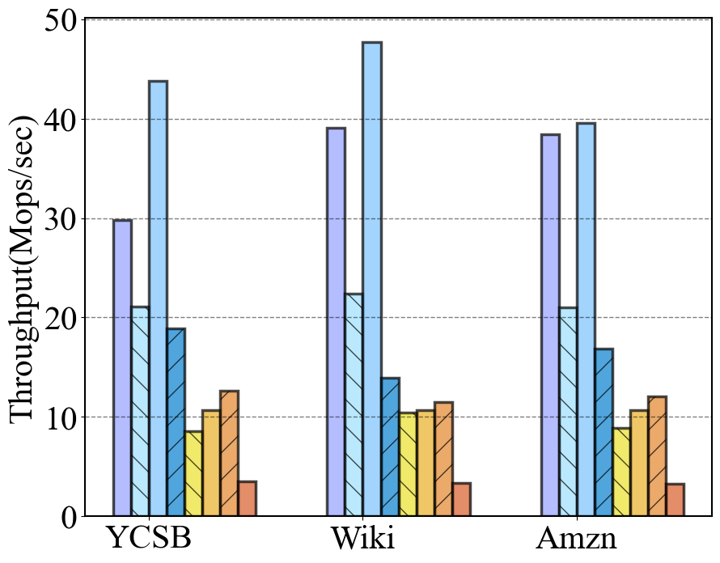
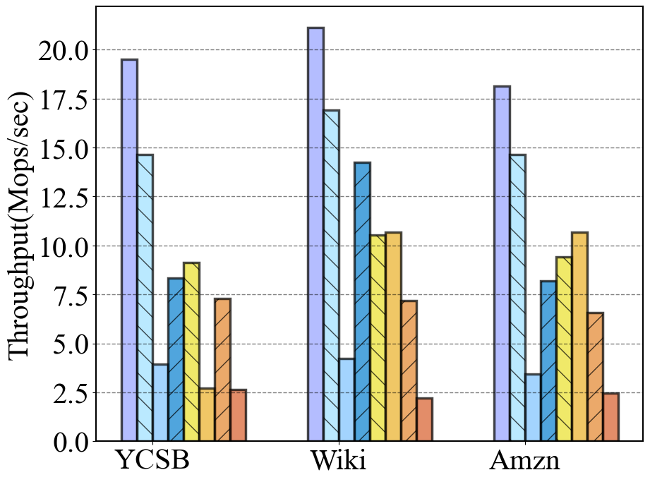

# ROST
ROST is a concurrent learned range index.

## Prerequisites
This project uses CMake (3.15+) for building and testing.
It also requires dependencies of jemalloc.

## Build and Run
We use CMake to build ROST.
```shell
mkdir build
cd build
cmake ..
make
./LearnedSkipList
```
You can set the variant 'DoTestBench' to 'True' and after building you can run './LearnedSkipList' to run performance test.

## Some Experiment Results
The figures below are the result of the 32 thread test of ROST and some counterparts on the data set YCSB, Wiki and Amzn with  64M 8Bytes integer.

<center class="half">

 &emsp; &emsp;&emsp;Throughput on read-only workload
 
 &emsp; &emsp;&emsp;Throughput on write-only workload
</center>
